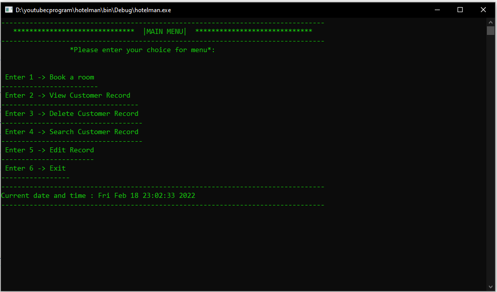

Here’s a `README.md` file for your Hotel Management System project:

---

# Hotel Management System in C

This is a password-protected Hotel Management System built using C language, providing basic functionalities for managing hotel operations.

## Features

- **Password Protected**: Secure login system for accessing hotel management functionalities.
- **User-friendly Interface**: Simple and intuitive interface for ease of use.
- **Hotel Operations Management**: Manage bookings, customer details, and other hotel services.

## Screenshot



## How to Use

1. Clone or download the repository.
2. Compile the `C` source code and run the program.

   ```bash
   gcc hotel_management.c -o hotel_management
   ./hotel_management
   ```

3. **Login Credentials**:
   - Username: `user`
   - Password: `pass`

4. Upon successful login, you can access various hotel management operations such as booking, check-in, and customer record management.

## Contributing

If you find any issues or have suggestions for improvements, feel free to raise an issue or contribute to the project by submitting a pull request.

---

#### Tags: `#C-language` `#hotel-management-system` `#mini-project`


